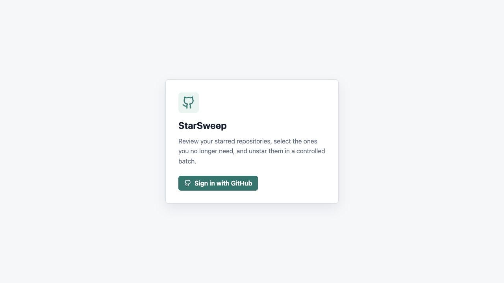
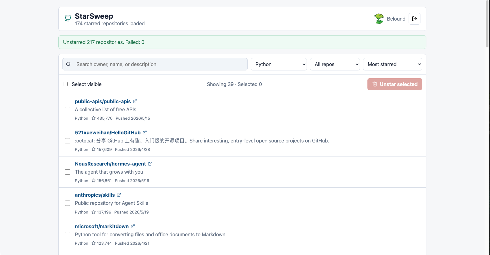
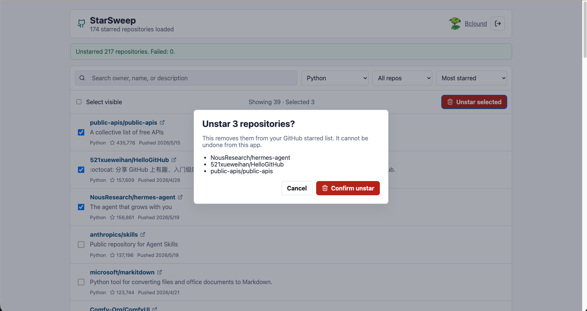

# StarSweep

Clean up years of GitHub stars without the panic button.

StarSweep is a focused web app for reviewing, filtering, and safely batch unstarring GitHub repositories. It is built for people with hundreds of starred projects who want a calm way to decide what still matters.



## Why StarSweep

GitHub stars are easy to collect and hard to revisit. After a few years, your starred list can turn into a quiet archive of experiments, old libraries, abandoned tools, and projects you no longer need.

StarSweep gives you a safer review surface: load everything, filter aggressively, select deliberately, and confirm before anything is removed.

## Product Screens

The repository includes a signed-out screenshot at `public/screenshot.png`.

For the best GitHub README preview, add authenticated product screenshots with these filenames:

```text
public/dashboard.png
public/confirm-unstar.png
```

Then this section will render the full workflow:

| Review stars | Confirm unstar |
| --- | --- |
|  |  |

## What It Does

- Sign in with GitHub OAuth
- Load your starred repositories with pagination
- Search by owner, repository name, or description
- Filter by language and archived status
- Sort by pushed date, star count, or name
- Select repositories one by one or select all visible results
- Confirm destructive changes before unstarring anything
- Show succeeded and failed repositories after a batch action
- Keep the GitHub token in an HTTP-only encrypted session cookie

## How It Works

1. Sign in with GitHub OAuth.
2. StarSweep loads your starred repositories page by page.
3. You search, filter, and sort the list locally.
4. You select only the repositories you want to remove.
5. StarSweep shows a confirmation dialog with the selected repositories.
6. The server calls the GitHub REST API to unstar each selected repository.
7. Successful removals disappear from the list; failures remain visible.

## Safety First

StarSweep deliberately does not include an "unstar everything" button.

Every destructive operation requires explicit selection and a confirmation dialog. Successfully unstarred repositories are removed from the local list, while failed repositories stay visible so you can retry or inspect them.

The app stores the GitHub access token only in an HTTP-only encrypted session cookie. Browser JavaScript never receives the raw token.

## Tech Stack

- Next.js App Router
- React
- TypeScript
- GitHub REST API
- GitHub OAuth
- jose encrypted sessions
- Vitest

## Local Setup

Create a GitHub OAuth App at:

```text
https://github.com/settings/developers
```

For local development, set the callback URL to:

```text
http://localhost:3000/api/auth/callback/github
```

Copy the environment template:

```bash
cp .env.example .env.local
```

Fill in:

```bash
GITHUB_CLIENT_ID=
GITHUB_CLIENT_SECRET=
SESSION_SECRET=replace-with-at-least-32-random-characters
NEXT_PUBLIC_APP_URL=http://localhost:3000
```

Install dependencies and start the app:

```bash
npm install
npm run dev
```

Open:

```text
http://localhost:3000
```

## Deployment Notes

StarSweep needs server-side API routes for OAuth, encrypted sessions, and GitHub API calls, so it should be deployed to a platform that supports Next.js server functions, such as Vercel.

For production, create a separate GitHub OAuth App and set its callback URL to your deployed domain:

```text
https://your-domain.com/api/auth/callback/github
```

Then configure the production environment variables:

```bash
GITHUB_CLIENT_ID=
GITHUB_CLIENT_SECRET=
SESSION_SECRET=
NEXT_PUBLIC_APP_URL=https://your-domain.com
```

## Scripts

```bash
npm test
npm run build
npm run dev
```

## Roadmap Ideas

- Export selected repositories before unstarring
- Add review labels like keep, remove, and review later
- Add filters for stale, archived, forked, or low-activity repositories
- Add a dry-run report mode
- Save review sessions for large star lists

## License

MIT
